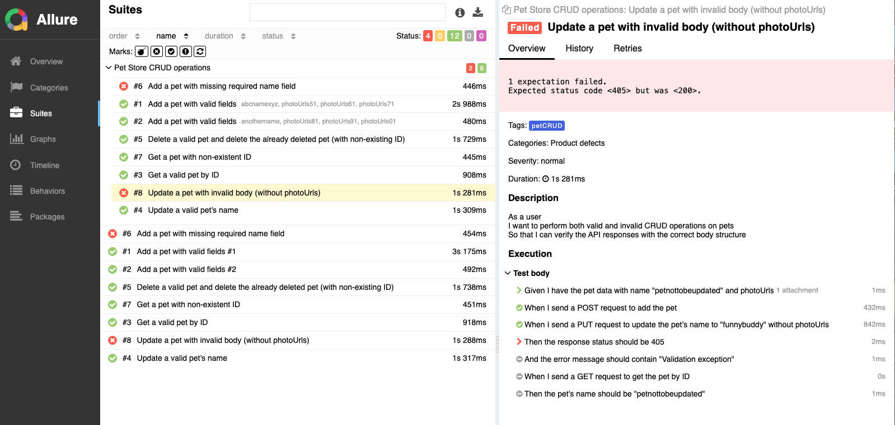

# Petstore API Test Automation Framework

This framework is designed to test the CRUD operations of the Petstore Sample API using Java, Maven, and several libraries for efficient, scalable, and easily understandable automated testing. The framework employs Cucumber BDD for structured and readable test cases, Rest Assured for API interactions, and Allure and Cucumber HTML for comprehensive reporting.

## Table of Contents
- [Technologies Used](#technologies-used)
- [Project Structure](#project-structure)
- [Setup and Installation](#setup-and-installation)
- [Running Tests](#running-tests)
- [Generating Reports](#generating-reports)
- [Configuration](#configuration)
- [Sample Test Scenarios](#sample-test-scenarios)

## Technologies Used
- **Java**: Language used for implementing test cases
- **Maven**: Dependency management and build tool
- **Cucumber BDD**: Behavior-Driven Development to write clear and understandable tests
- **Rest Assured**: For making HTTP requests to the API
- **Cucumber HTML Report**: For BDD-style reporting
- **Allure Report**: For detailed, visual test execution reports
- **JsonSchemaValidator**: For validating JSON response schemas
- **Page Object Model (POM)**: For modularizing and organizing code

## Project Structure


## Setup and Installation

1. **Clone the repository:**

    ```bash
    git clone https://github.com/eyupUK/task-api-test.git
    cd task-api-test
    ```

2. **Install dependencies:**

    ```bash
    mvn clean install
    ```

3. **Install Allure:**

    ```bash
    brew install allure
    ```

## Running Tests

To run the tests, execute the following command in the terminal:

```bash
mvn clean test
```

## Generating Reports

To generate the Cucumber HTML report, execute the following command in the terminal:

```bash
mvn verify
```
To execute specific Cucumber tags, use:

```bash
mvn test -Dcucumber.options="--tags @tagname"
``` 

To generate and open the Allure report:

```bash
allure serve
```

To generate and open the Allure report:

```bash
mvn allure:serve
```


## Configuration

You can configure test settings in the configuration.properties file. Key configurations include:

pet_baseurl: Base URL of the API

timeout: Timeout settings for API requests

## Sample Test Scenarios

